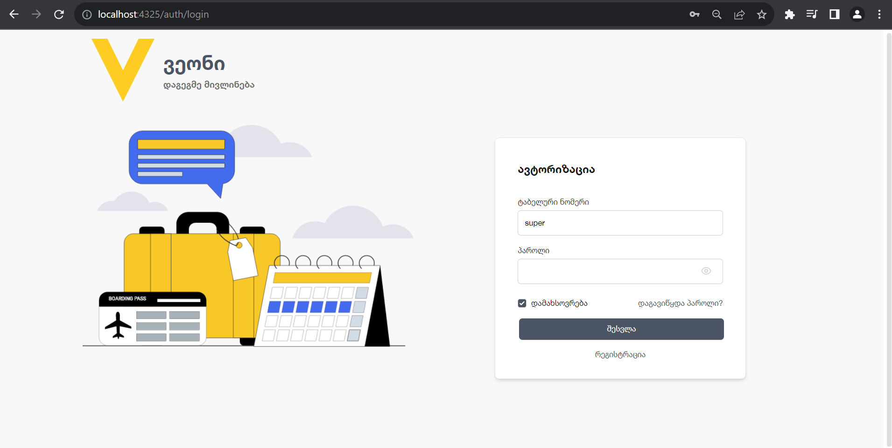

###Project Name & Pitch
#Veon

##An application used to create and manage trips,create and manage users and user roles, built with Angular and SCSS(Tailwind).

##Project Screen Shot(s)
Login Screenshot

// more screens

##Installation and Setup Instructions
##Clone down this repository. You will need node and npm installed globally on your machine.

##Node download link :

##Installation:

npm install

##To Start Server:

npm start veon

##To Visit App:

http://localhost:4325/
